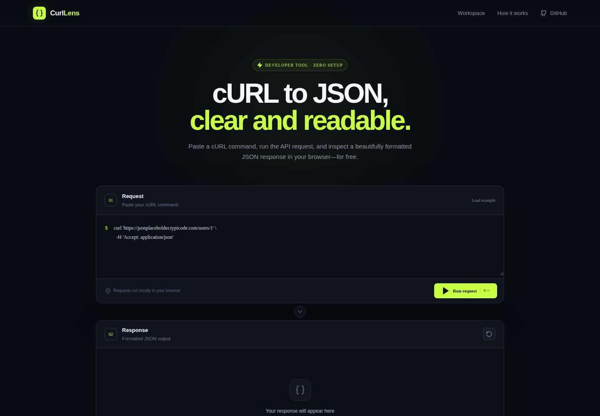
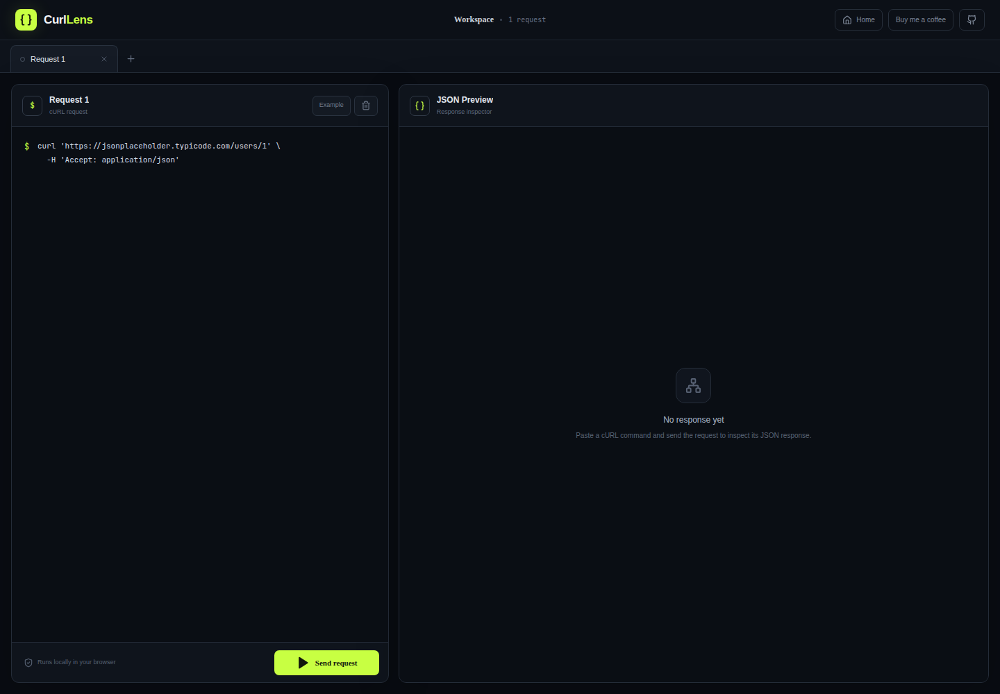

<div align="center">
  

  # CurlLens

  **Run cURL requests and turn API responses into clear, searchable JSON.**

  [Open CurlLens](https://www.curljson.help/) · [Launch Workspace](https://www.curljson.help/workspace) · [Report an issue](https://github.com/ailuvu-art/curl-to-formater-json/issues)

  [](https://www.curljson.help/)
  [](https://www.curljson.help/)
  [](https://react.dev/)
</div>



## What is CurlLens?

[CurlLens](https://www.curljson.help/) is a free, browser-based cURL to JSON formatter and API response viewer. Paste a cURL command, run the equivalent request from your browser, and inspect the result as an expandable JSON tree, syntax-highlighted code, or raw text.

It is useful when you copy a command from API documentation and want a fast visual way to understand the response without setting up a full API client.

## Features

- Parse common cURL options: URL, method, headers, and request body
- Run API requests directly from the browser or through the optional local agent
- Explore nested data with an expandable JSON tree
- Switch between tree, highlighted code, and raw text views
- Search and copy formatted responses
- View HTTP status, request duration, response size, and line count
- Manage multiple requests in the dedicated workspace
- No account required; the application does not proxy requests through its own server

## Local Agent

When a request is blocked by browser CORS, run it through the optional CurlLens Local Agent. It executes on your computer and can also reach localhost, LAN, and VPN endpoints.

```bash
# Install/configure and start the background service
npx @nolann-dev/curllens-agent install

# Later lifecycle commands
npx @nolann-dev/curllens-agent start
npx @nolann-dev/curllens-agent status
npx @nolann-dev/curllens-agent stop
npx @nolann-dev/curllens-agent uninstall
```

Copy the connection token printed by `install`, choose **Local Agent** in CurlLens, and paste the token. Node.js 20 or newer is required. See [`local-agent/README.md`](local-agent/README.md) for configuration and security details.

> Repository contributors can test an unpublished checkout with `npm exec --package ./local-agent -- curllens-agent install`.

## Quick start

Try CurlLens online at **[www.curljson.help](https://www.curljson.help/)**.

Paste this example:

```bash
curl 'https://jsonplaceholder.typicode.com/users/1' \
  -H 'Accept: application/json'
```

Then select **Run request**. CurlLens executes the request and presents the response in a navigable JSON viewer.

### POST request example

```bash
curl 'https://jsonplaceholder.typicode.com/posts' \
  -X POST \
  -H 'Content-Type: application/json' \
  -d '{"title":"Hello","body":"Created with CurlLens","userId":1}'
```

> [!IMPORTANT]
> CurlLens runs requests in the browser. An endpoint can work in terminal cURL but fail in CurlLens when the API does not allow cross-origin browser requests (CORS). Never paste production secrets into a public or shared device.

## Multi-request workspace

The [CurlLens Workspace](https://www.curljson.help/workspace) lets you keep several requests open in tabs and compare API responses without leaving the page.



## Guides

- [Convert a cURL command to formatted JSON](docs/guides/curl-to-json.md)
- [Understand and troubleshoot cURL CORS errors](docs/guides/curl-cors-errors.md)
- [Useful cURL examples for testing JSON APIs](docs/guides/curl-api-examples.md)

## Run locally

### Requirements

- Node.js 20 or newer
- npm

```bash
git clone https://github.com/ailuvu-art/curl-to-formater-json.git
cd curl-to-formater-json
npm install
npm run dev
```

Open the local URL printed by Vite.

### Production build

```bash
npm run build
npm run preview
```

## How it works

1. `tokenizeCurl` splits a cURL command while preserving quoted values.
2. `parseCurl` extracts the URL, HTTP method, headers, and request body.
3. Browser mode sends the equivalent request directly to the target API; Local Agent mode sends it to the authenticated loopback service for execution.
4. CurlLens parses JSON when possible and retains the raw response for text view.
5. The response viewer renders expandable tree nodes or syntax-highlighted JSON.

## Privacy and security

CurlLens does not use an application backend to proxy cURL requests. Your browser connects directly to the target API. That means:

- the target API receives the URL, headers, and body you provide;
- browser CORS rules apply;
- secrets remain in the current browser session, but you should still avoid shared devices, screen sharing, and untrusted extensions;
- you should review a command before running it, especially when it contains authorization headers.

## Contributing

Issues and focused pull requests are welcome. Before submitting a change:

```bash
npm run build
```

Please include reproduction steps for bugs and screenshots for visual changes.

## Tech stack

- React 18
- TypeScript
- Vite
- Chakra UI
- Lucide React
- Vercel Web Analytics

## Support and links

- Website: [https://www.curljson.help/](https://www.curljson.help/)
- Workspace: [https://www.curljson.help/workspace](https://www.curljson.help/workspace)
- Source: [github.com/ailuvu-art/curl-to-formater-json](https://github.com/ailuvu-art/curl-to-formater-json)
- Support the creator: [Buy me a coffee](https://buymeacoffee.com/nolann25)

## License

MIT
